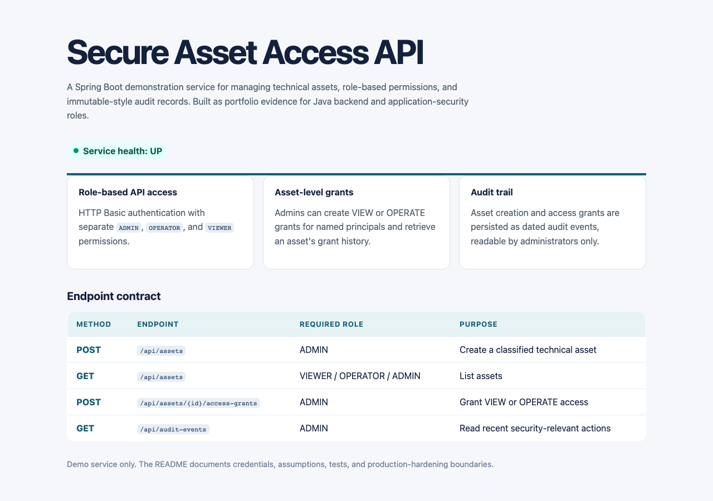

# Secure Asset Access API

A production-style Java backend demonstrator for managing classified technical assets, access grants, and security-relevant audit events. The API uses Spring Boot, Spring Security, JPA, H2, validation, role-based authorization, and actuator health checks.

> **Scope note:** This is a portfolio project. It demonstrates secure API design and testing patterns, but it is not a complete identity platform or a production deployment. The H2 database is deliberately local and ephemeral.



## Capabilities

- Create `INTERNAL` or `RESTRICTED` technical assets.
- Enforce distinct `ADMIN`, `OPERATOR`, and `VIEWER` roles through Spring Security HTTP Basic authentication.
- Allow administrators to create `VIEW` or `OPERATE` grants for a named principal.
- Persist asset creation and access-grant actions as audit events.
- Return RFC 9457-style problem details for unknown assets.
- Expose a public health endpoint at `/actuator/health`; all business endpoints require authentication.
- Validate the API end-to-end with Spring MockMvc integration tests.

## Run locally

Requirements: Java 21+ and Maven 3.6.3+.

```bash
git clone https://github.com/mithulram/secure-asset-access-api.git
cd secure-asset-access-api
mvn spring-boot:run
```

Visit [http://localhost:8080](http://localhost:8080) for the API dashboard. The dashboard checks the live actuator health endpoint.

The default credentials are intentionally obvious, local-only demo values:

| Username | Role | Default password |
|---|---|---|
| `admin` | `ADMIN` | `demo-admin-change-me` |
| `operator` | `OPERATOR` | `demo-operator-change-me` |
| `viewer` | `VIEWER` | `demo-viewer-change-me` |

Override them before any non-local use:

```bash
export ASSET_ACCESS_ADMIN_PASSWORD='use-a-local-secret'
export ASSET_ACCESS_OPERATOR_PASSWORD='use-a-local-secret'
export ASSET_ACCESS_VIEWER_PASSWORD='use-a-local-secret'
mvn spring-boot:run
```

## API examples

Create an asset as an administrator:

```bash
curl -u admin:demo-admin-change-me \
  -H 'Content-Type: application/json' \
  -d '{"name":"ECU diagnostics gateway","ownerTeam":"Vehicle Security","classification":"RESTRICTED"}' \
  http://localhost:8080/api/assets
```

List assets as a viewer:

```bash
curl -u viewer:demo-viewer-change-me http://localhost:8080/api/assets
```

Grant access as an administrator, substituting an asset ID from the create response:

```bash
curl -u admin:demo-admin-change-me \
  -H 'Content-Type: application/json' \
  -d '{"principal":"vehicle-validation-team","permission":"OPERATE"}' \
  http://localhost:8080/api/assets/{assetId}/access-grants
```

## Endpoint authorization matrix

| Method | Endpoint | Roles | Purpose |
|---|---|---|---|
| `GET` | `/actuator/health` | public | Liveness/health signal |
| `POST` | `/api/assets` | ADMIN | Create a classified asset and audit event |
| `GET` | `/api/assets`, `/api/assets/{id}` | VIEWER, OPERATOR, ADMIN | Read the asset catalogue |
| `POST` | `/api/assets/{id}/access-grants` | ADMIN | Create a named access grant and audit event |
| `GET` | `/api/assets/{id}/access-grants` | VIEWER, OPERATOR, ADMIN | Read an asset's grants |
| `GET` | `/api/audit-events` | ADMIN | Read the latest 50 audit events |

## Verify

```bash
mvn verify
mvn package -DskipTests
```

The integration suite validates public health access, unauthenticated rejection, admin creation, viewer reads, operator write denial, access-grant creation, audit records, payload validation, and missing-resource responses.

## Design notes

- **Authentication:** HTTP Basic is suitable for a compact local demonstrator, not a modern production SSO strategy. A production version would use an OIDC provider, short-lived tokens, secret management, and transport-level controls.
- **Authorization:** Route-level role checks establish a clear, testable contract. The project records asset-level grants, while an extension could enforce those grants against an enterprise identity directory.
- **Persistence:** H2 keeps a fresh clone runnable. A production profile should substitute a managed PostgreSQL database and migrations.
- **Auditability:** Events record actor, action, target, and timestamp. For tamper resistance in production, audit events would be forwarded to a separate append-only logging system.

## Architecture

```mermaid
flowchart LR
    C[Client] --> S[Spring Security\nHTTP Basic + roles]
    S --> A[Asset & grant controllers]
    A --> B[Transactional service layer]
    B --> D[(JPA / H2)]
    B --> E[Audit event store]
    C --> H[/actuator/health]
```

## Resume-ready description

> Built a Java/Spring Boot asset-access API with validated REST endpoints, role-based authorization, JPA persistence, access grants, audit events, actuator health checks, and end-to-end MockMvc security tests.

## License

MIT. See [LICENSE](LICENSE).
